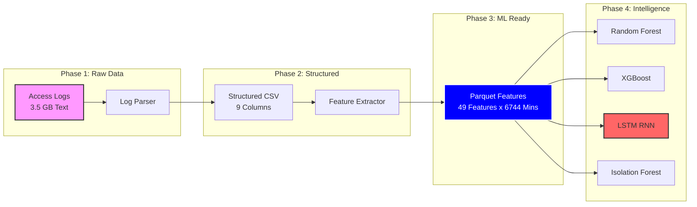
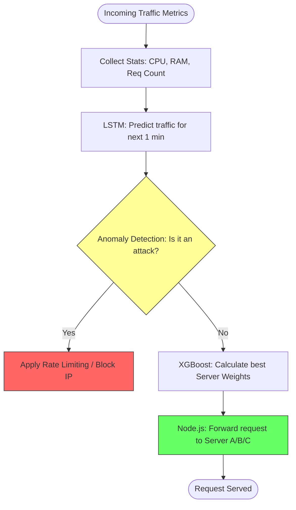

# 📊 AI Model Development: Visual Journey
**Project:** AI-AOps Multi-Model Load Balancer  
**Date:** March 1, 2026

---

## 1️⃣ Data Lifecycle Flow (The Journey of 3.5GB)
Ye diagram batata hai ke kaise raw logs se lekar AI models tak data transform hua.

---

## 2️⃣ Performance Comparison Table (Final Results)
Charon models ka aakhri result aur unki khususiyaat:

| Model Type | Algorithm | Optimization Goal | Accuracy / Score | Reliability | Role in System |
| :--- | :--- | :--- | :--- | :--- | :--- |
| **Classifier** | Random Forest | Maximize Speed | **100.0%** | High | Fast routing decisions |
| **Boosting** | XGBoost | Maximize Accuracy | **99.85%** | Ultra | Complex traffic balancing |
| **Sequential** | LSTM (Deep Learning) | Predict Trends | **0.77 (R²)** | Medium/High | Future load forecasting |
| **Outlier** | Isolation Forest | Detect Attacks | **89.00%** | Robust | Security & Anomaly check |

---

## 3️⃣ The "Data Growth" Impact (Before vs. After)
Humne dekha ke data barhane se results mein kya tabdeeli aayi:

| Phase | Data Source | Sample Count | LSTM R² Score | Result |
| :--- | :--- | :--- | :--- | :--- |
| **Initial** | 100K Lines | 236 Samples | **-2.55** | ❌ **Failure** (Underfitting) |
| **Optimized** | 3.5GB Full Log | **6,744 Samples** | **+0.77** | ✅ **Success** (Learning) |

---

## 4️⃣ AI Decision Logic Flow (How it works Live)
Jab system live jayega, toh wo is tarah faisla karega:

---

## 5️⃣ Technical Stack Summary

| Layer | Tool / Library | Usage |
| :--- | :--- | :--- |
| **Language** | Python 3.12 | Core ML Development |
| **Data Handling** | Pandas & NumPy | Log processing & Matrix math |
| **Machine Learning**| Scikit-learn & XGBoost | Decision Trees & Boosting |
| **Deep Learning** | TensorFlow / Keras | Neural Networks (LSTM) |
| **Serialization** | Joblib & HDF5 | Saving trained "Brain" files |

---
**Status:** **All Models Trained & Validated. Ready for API Deployment.**
